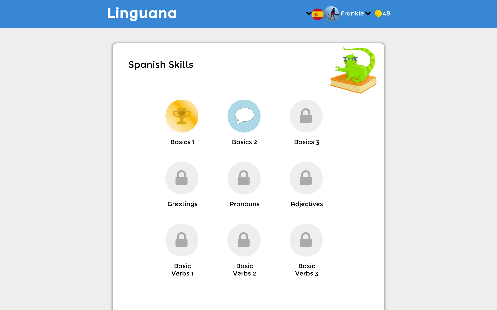
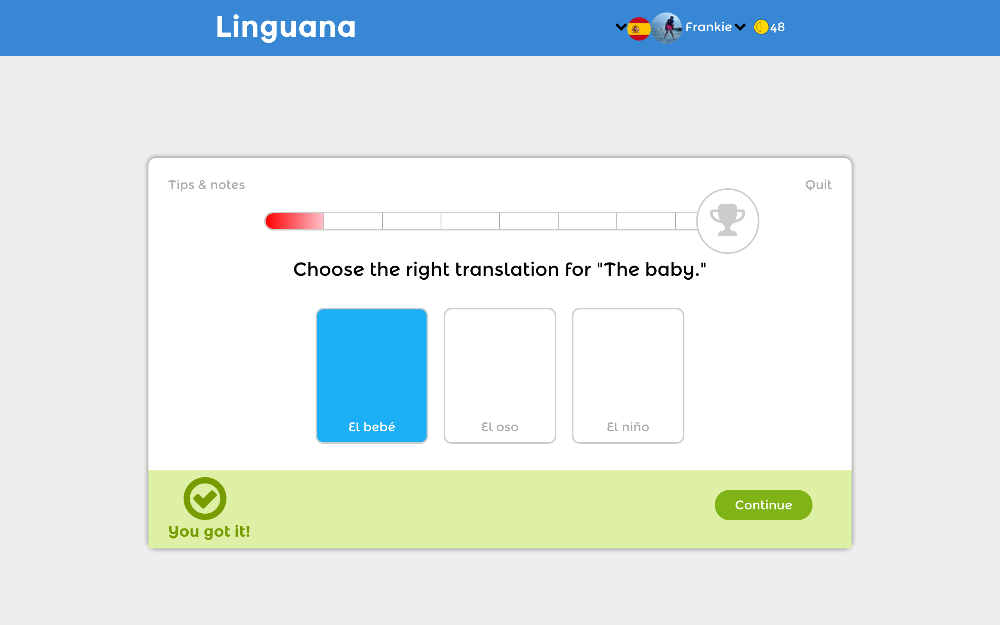

# Linguana

## Summary

Linguana is a gamified language-learning app that draws inspiration from Duolingo and was built using an array of technologies including Ruby on Rails, React.js and PostgreSQL.

## Features

### Cookie Store

A Flux-enabled cookie store sets and gets information from cookies in localStorage. Thanks to this, users are able to enjoy much of the same functionality when logged out as they can when logged in. If a logged-out user completes an entire course, she can save her progress to the database by simply logging in or creating an account. The cookie store sets browser cookies for everything from the current course to an array of completed completables, and AJAX requests are sent out on login to persist any relevant information from the cookies.

### Completables

A polymorphic completables association is used to keep track of users' completions of courses, skills and lessons. This helps keep the code DRY and readily extensible.

### Authentification

[BCrypt][bcrypt-link] is used to encrypt users' passwords, which are then securely stored in a `password_digest` column in the users table.

### OAuth

OmniAuth integration offers convenient login and signup using Facebook and Google. When a user signs up through either service, their relevant info is pulled and a new user is created in the database.

### Paperclip and Amazon Web Services

URLs and important data about images such as users' profile pictures are stored in the database with aid from [paperclip][paperclip]. The images themselves are stored remotely using Amazon S3.

## Languages and Technologies

* Ruby on Rails
* React.js
* Flux architecture
* PostgreSQL
* HTML/CSS

## Some Important Gems

* [bcrypt][bcrypt-link]
* [figaro][figaro-link]
* [omniauth-facebook][oauth-facebook]
* [omniauth-google-oauth2][oauth-google]
* [paperclip][paperclip]
* [aws-sdk][aws]

## Some Important NPM Packages

* [babel][babel]
* [react][react]
* [react-router][react-router]
* [webpack][webpack]
* [flux][flux]

[bcrypt-link]: https://github.com/codahale/bcrypt-ruby
[oauth-facebook]: https://github.com/mkdynamic/omniauth-facebook
[oauth-google]: https://github.com/zquestz/omniauth-google-oauth2
[paperclip]: https://github.com/thoughtbot/paperclip
[aws]: https://github.com/aws/aws-sdk-ruby
[figaro-link]: https://github.com/laserlemon/figaro

[flux]: https://github.com/facebook/flux
[webpack]: https://webpack.github.io/
[react-router]: https://github.com/reactjs/react-router
[react]: https://facebook.github.io/react/docs/getting-started.html
[babel]: https://github.com/babel/babel
